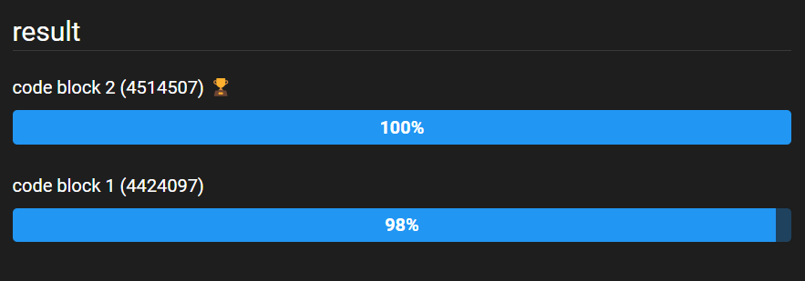

# Les Petits Plats
## Développez un algorithme de recherche en JavaScript

Maquettes : https://www.figma.com/file/LY5VQTAqnrAf0bWObOBrt8/Les-petits-plats---Maquette-2.0?node-id=0%3A1&mode=dev

------------
### Description du projet
Ce projet consiste à développer un algorithme de recherche efficace pour une plateforme de recettes de cuisine.

### Cahiers des charges
##### Spécifications techniques
1. Utiliser des outils et méthodes avancées de JavaScript.
2. Concevoir l'interface utilisateur du site.
3. Développer deux versions d'un algorithme de recherche, capables de parcourir et de filtrer efficacement un fichier JSON.
4. Implémenter ces algorithmes.
5. Analyser et comparer leurs performances.
6. Utiliser des outils comme Jsben.ch ou d'autres outils de test de performances.
7. Identifier l'algorithme le plus efficace.
8. Documenter votre travail et expliquer pourquoi cet algorithme est le plus adapté pour le site.
9. Prendre en compte les principes du Green Code. 

### Compétences acquises
- Analyser un problème informatique
- Développer un algorithme pour résoudre un problème

### Informations complémentaires
- Soutenance validé le : 27/03/2024

#### Livrable
##### Points forts :

- Fiche d'investigation présente et complète
- Présence du logigramme
- Le logigramme est bon & cohérent
- Choix de l'algo clairement justifié avec présence d'un benchmark
- Repo git avec 2 branches ok
- Approche JS bonne & cohérente
- Bon découpage du code JS avec des fonctions réutilisables.

#### Soutenance
##### Remarques :

- Présentation fluide & structurée
- Timing respecté
- Chaque point du brief. a été présenté
- Tous les choix ont été justifié
- Bonne compréhension globale de la mise en place d'algo et comparaison de ceux-ci

#### Conclusion

Algorithme 2 : Boucle native (for)
La boucle "For" est la méthode la plus rapide pour parcourir un tableau.

